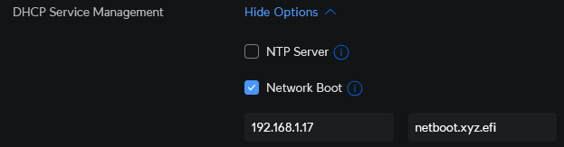

# Introduction
[NetbootXYZ](https://github.com/netbootxyz/netboot.xyz) is an all-in-one tool for network boot/installation of a variety of operating systems.

I've modified the base installation to include an option to install Omni-managed Talos OS instances. To do this, files are added to the [netbootxyz/config/menus/local](https://github.com/kenlasko/docker-rpi1/tree/main/netbootxyz/config/menus/local) folder. I've added 2 files:
- [menu.ipxe](https://github.com/kenlasko/docker-rpi1/blob/main/netbootxyz/config/menus/local/menu.ipxe) replaces the default menu with one that includes Omni as the default option
- [omni_SAMPLE.ipxe](https://github.com/kenlasko/docker-rpi1/blob/main/netbootxyz/config/menus/local/omni_SAMPLE.ipxe) installs the latest version of Talos OS. This should be renamed to `omni.ipxe` and should be modified to include your unique Omni join token. The join token can be found on the main Omni page on the right side by clicking on `Copy Kernel Parameters`

For my actual installation, the `omni.ipxe` file is populated via the SOPS [secrets.yaml](/secrets.yaml) file because the join token needs to be encrypted in the repository. The unencrypted file is .gitignored.

For more information about deploying SOPS/age, see the main [README.md](/README.md)

# Prerequisites
While the base installation of NetBootXYZ can be used to install a wide variety of operating systems, its intended as the starting point for my Sidero Labs Omni-based Talos Kubernetes cluster. As such, the following needs to be done:
- Install and configure self-hosted [Omni](https://github.com/kenlasko/omni) using my repo, or alernatively subscribe to [Sidero Lab's cloud-hosted Omni](https://www.siderolabs.com/omni-signup/) 
- A network environment capable of advertising a network boot server. I use Unifi.

# Installation
1. Modify the `netbootxyz` section of the [docker-compose.yaml](/docker-compose.yml) for your needs
2. Run `docker compose up -d netbootxyz` to create the deployment
3. Copy the contents of the [/netbootxyz/config/menus/local](https://github.com/kenlasko/docker-rpi1/tree/main/netbootxyz/config/menus/local) folder into the NetbootXYZ Docker folder. This creates a menu entry for the custom Talos/Omni install. 
4. Modify the `set omni_params` line in [omni_SAMPLE.ipxe](https://github.com/kenlasko/docker-rpi1/blob/main/netbootxyz/config/menus/local/omni_SAMPLE.ipxe) to match those in your Omni environment. You can obtain the appropriate values for `siderolink.api`, `talos.events.sink` and `talos.logging.kernel` by clicking the `Copy Kernel Parameters` button from the Omni `Home` page.
    1. Alternatively, use [omni-SAMPLE_LOCAL.ipxe](https://github.com/kenlasko/docker-rpi1/blob/main/netbootxyz/config/menus/local/omni_SAMPLE_LOCAL.ipxe) for fast local booting. You will have to download the Talos assets manually. Modify the Omni paramaters as required.
5. Rename `omni_SAMPLE.ipxe` to `omni.ipxe`
6. In your network router, configure TFTP to point to the IP address of the Docker host running the NetBootXYZ container and set the path to `netboot.xyz.efi`. If you happen to use Unifi, then follow these steps:
    1. In Unifi network app, go to `Networks - YourNetworkName`
    2. Scroll down to `DHCP Service Management` and click on `Show Options`
    3. Enable `Network Boot` and set the appropriate IP address and path
    4. Save!

    

7. Now boot up a node and set it to network boot. With any luck, it should boot right to Talos in maintenance mode ready to be joined to an Omni-managed cluster!
